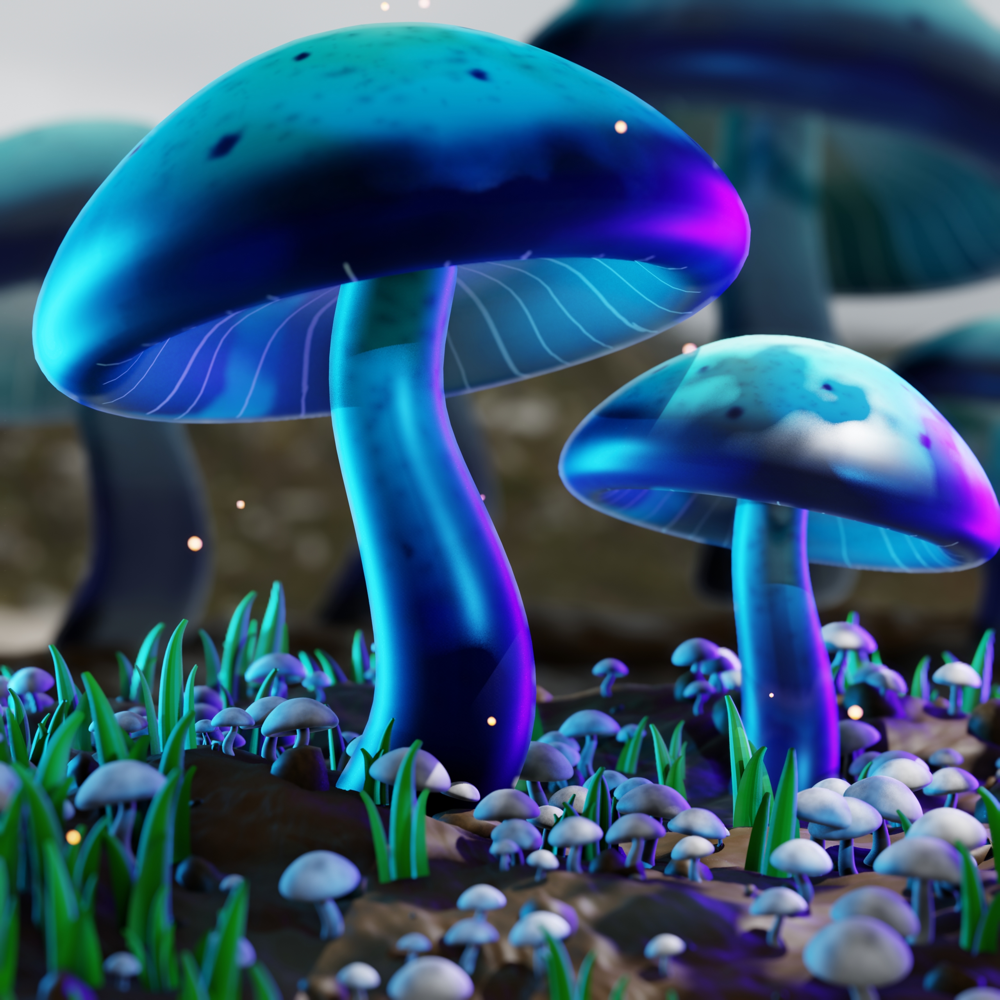

# Magical Mushrooms – Blender Animation 🍄

This project is a 3D animated scene created using Blender as part of a Computer Graphics university course.

## 🎬 Render Video
👉 [Watch the render video here](https://drive.google.com/file/d/1yZ8VbIiILhUUjxv3hcgEYAOZn8mn76ur/view?usp=sharing)

## 🛠 Tools Used
- Blender

## 📌 Project Description
The project includes 3D modeling, lighting, materials, animation, and final rendering.
All steps were created and explained step by step during the project process.

## 🎓 Academic Context
This project was developed as a final project for the Computer Graphics course.

## 📷 Screenshots
### Final Render

